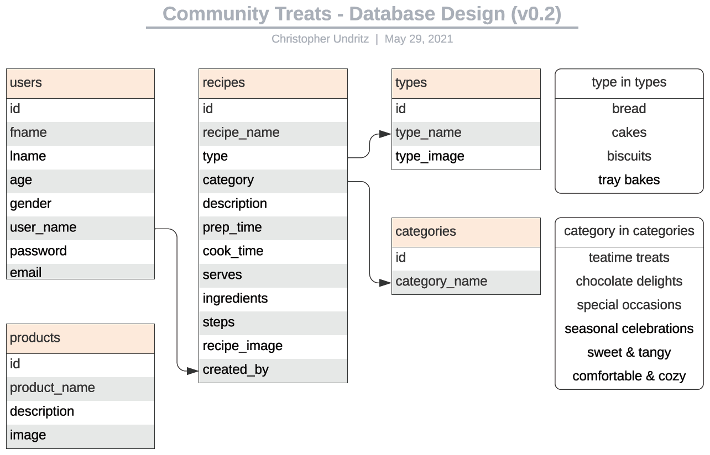
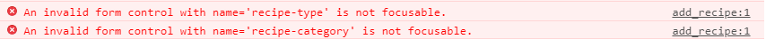
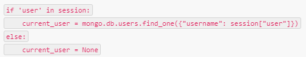

# Community Treats - Readme document

  

### Website can be viewed here: 
### Project GitHub site: 

### **Disclaimer: This Website is for educational purposes only.**

---
# Table of Contents
* [OVERVIEW](#overview)
* [STRATEGY](#strategy)
* [SCOPE](#scope)
* [STRUCTURE](#structure)
* [SKELETON](#skeleton)
* [SURFACE](#surface)
* [TECHNOLOGIES USED](#technologies-used)
* [TESTING](#testing)
* [NOTED DESIGN CHANGES](#noted-design-changes)
* [FURTHER DEVELOPMENT](#further-development)
* [DEVELOPMENT AND DEPLOYMENT](#development-and-deployment)
* [MODIFYING THE GAME](#modifying-the-game)
* [CREDITS AND THANKS](#credits-and-thanks)

---
># **OVERVIEW**
Online communities are groups of people who share knowledge and ideas on a common interest. Contributing, enabling and growing online communities gets a company involved with their target audience which can increase brand awareness.  People who already have a vested interested in the topic or content you’re promoting will be exposed to your brand, website and business. As a result, your business will be etched in their mind—much more so than a competitor who doesn’t contribute to the said community.

Creating and/or hosting relevant content will drive relevant traffic to your site; and lessen click through traffic.  By attracting relevant traffic (people who are actually interested in what you have to offer or say) to your website, they’re already more likely to purchase. Why? Because people purchase when they’re genuinely interested in something. 

This project is concerned with the build of a full-stack site that showcases full CRUD functionality to allow a user to view, manage and contribute to a baking recipe dataset.  The site is called 'Community Treats' which is associated with a fictional company called 'Mix'in Bowls' who need to increase brand awareness.  The project showcases the use of current technologies to deliver backend content to the user and present in an attractive responsive and user friendly fashion.

---
># **STRATEGY**
Mix'in Bowls is a small company that has enjoyed some high street success and is now due to launch its online commercial store within the next few months.  Mix'in Bowls has had presence on the main social platforms for a number of years, however, in the run up to their commercial website launch, they now want to also create an intimate community where their brand in front and center to the users and customers of the site.  

'Community Treats' by Mix'in Bowls is the answer to this.  It is a community website extension to the retail website that allows users to upload baking recipes and view others uploaded from other community members.  The aim is to grow an online community to promote home baking, increase company and product awareness which will covert into sales of the latest Mix'in Bowls products.

Increasingly baking attracts people from a number of demographics due to the popularity of baking programmes like 'The Great British Bake-off' and also more recently due to the global pandemic.  Therefore the website is designed to be attractive to a broad spectrum of users and abilities.  The sites uses mainstream current technologies to deliver a streamlined user experience that is responsive across devices.  

# User Stories

As the site buiness owner I want to:

* *Promote the Mix'in Bowls brand prior to commercial website launch*
* *Link through to the commercial website to promote Mix'in Bowl products that could be used for the recipes*
* *Gain an understanding of the demographic of customer by gaining basic information from them*
* *Administer the site through an admin login to manage content*

As a user of this software I want to be able to:
* *Easily use the site on any device*
* *Easily navigate the site*
* *View baking recipes across a number of categories*
* *Find easily a recipe through search functionality*
* *Login and have a personalised experience*
* *Upload my recipes*
* *Update and delete my recipes*
* *Contact Mix'in Bowls to report issues and/or provide feedback*
* *link through to the main social media sites from the website*

---
># **SCOPE**
# Content
### The presentation of the site is concerned with:
1.	Being attractive and engaging from the outset to encourage the user to explore the site.
2.	Being simple in presentation and use; the focus of the site is the creating, reading (viewing), updating and deleting (CRUD) the content.   

## Functional Requirements
1.	To be viewing a recipe within a couple of clicks/taps
2.	Mobile first; the site is designed to work on mobile and tablet screens first, but responsive design ensures that it scales up and looks good on laptop and desktop screens. 
3.	Login button (with hint to register) on the landing page to encourage users to register for additional functionality.
4.	Flexible Navbar and site options to reflect a logged in user and admin user to restrict some functionality of the website.
5.	A Contact function/form that will allow the sending of feedback to an existing email using JSMail.
6.	Clear and obvious links to social media platforms.
7.	Feedback animations to provide players with clear interaction cues.

---
># **STRUCTURE**
# Database Schema

# Navigation
Navigation of the site content is facilitated by:
1. Navigation Bar fixed at the top of each page and always displayed when the user scrolls.
2. User specific navigation options displayed in the Navigation bar menu.
3. Call to action button on the landing page that will ask the user to login or direct them to register if not already a registered user.
4. A free text search field to allow first time visitors or registered users to start searching for specific keywords straight away.
5. Images related to the type of recipes that can be found on the site presented as links on the main page, so first time visitors or registered users can query recipes by type. 
6. A user 'My Page' which will feature the recipes uploaded by the user and their favourites so they can navigate to them directly
7. dynamic buttons throughout the sites that will display depending on who is logged in.  For instance a 'update' option displayed with a recipe only if the recipe author is logged in and viewing it.

This is in line with current website design and UX trends.

* [Website User Journey v0.1](assets/readme/community_treats-website_user_journey_v0.1.pdf)

# Searching
There are a few ways for the user to interrogate the database:
1) displaying all recipes by 'type'
2) displaying all recipes by 'category'
3) Using the free-text search

The free text search allows the user to search for documents within the recipes collection against the below fields using a text index type:
* recipe title
* description
---
# Consistent Features between pages
Each page has a responsive fixed navigation bar with the same links that reflect whether the user is logged in and who is logged in.  The navigation links are justified to the right and a logo is justified left that links to the home page.  

Each page features the same banner image with the text 'Community Treats by Mix'in Bowls' displayed.  Content dynamically displays over this.

A footer is present on every page with social media icons linking to the Facebook, twitter and Instagram

---
># **SKELETON**
# Wireframes
* [Mobile v0.1](assets/readme/community_treats_mobile-wireframe_v0.1.pdf)
* [Desktop v0.1](assets/readme/community_treats_desktop-wireframe_v0.1.pdf)

---
># **SURFACE**
# Theme
The website look and feel is consistent throughout, the ease of which is achieved through the use of Jinja templating and the Materialize framework 

The aim for the site to be simple yet engaging from the outset to encourage the site visitor to explore further.  However the pastel colour scheme, font choice and banner should leave the user in no doubt as to the content and purpose of the site.  

# Colours
The colours selected for the game are muted pastels which reflect the natural colours found in baking and associated ingredients

# Text
## Fonts
* [Mountains of Christmas](https://fonts.google.com/specimen/Mountains+of+Christmas?query=Christmas&preview.text=Community%20Treats&preview.text_type=custom)
* [Henny Penny](https://fonts.google.com/specimen/Henny+Penny?query=Henn&preview.text=Community%20Treats&preview.text_type=custom)
* [Mystery Quest](https://fonts.google.com/specimen/Mystery+Quest?preview.text=Community%20Treats&preview.text_type=custom#standard-styles)
* [Unkempt](https://fonts.google.com/specimen/Unkempt?preview.text=Community%20Treats&preview.text_type=custom)

---
># **TECHNOLOGIES USED**
* HTML5
* CSS3
* JavaScript 
* Python
* Flask web application framework
* Jinja template engine for Python
* Werkzeug [WSGI](https://wsgi.readthedocs.io/en/latest/) web application library
* MongoDB
* Materialize framework
* EmailJS
* Gitpod
* GitHub
* Heroku
* Google Fonts
* Font Awesome
* Balsamiq

---
># **TESTING**
>Testing completed is detailed in the [TESTING.md](TESTING.md) document

---
># **NOTED DESIGN CHANGES**
* Originally it was not planned for review functionality.  However, as development progressed, this became a possibility.  Originally the reviews were planned to be saved alongside the recipe that they were associated with.  However it was than conceived that if the reviews were saved in a separate collection, with the user id and recipe id then additional functionality could be implemented such as:
  1.  User reviews 'review' section in the users 'My Page' allowing them to review, edit and delete these.
  2.  Admin reviews 'review' section allowing them to moderate any reviews
  3.  Restriction of submitted reviews.  Not allowing multiple reviews from one user.

* Originally it was not planned to implement a ratings function.  However, as development progressed, this became a possibility.  The current implementation of the rating system does not require the user to be logged in and is not tied to the review functionality.  The thinking behind this is that more users will be inclinded to rate the recipes, if they do not have to have an account, be logged in, or leave a review.  This does present the risk that the ratings could be abused, however it is hoped that the baking community is well behaved!  The restriction that the author of the recipe cannot rate or review their own is implemented.

* There were two ways to present the ability to favourite the recipe to a user that is not logged in or not registered.  This feature is presented as a heart under the authors name which is empty when not favourited, and filled when it is.  The first option considered was to not show the heart at all unless the user is logged in.  However the implemented functionality is that the feature is shown, however when a non-registered or non-logged in user trys to use it, a modal pops up and directs them to either log in or register.  It is hoped that this will encourage more users to register.

---
># **FURTHER DEVELOPMENT**

---
># **DEVELOPMENT AND DEPLOYMENT**
* A repository was setup in GitHub using the Code Institute Gitpod [full template]( https://github.com/Code-Institute-Org/gitpod-full-template).
* Development was completed using Gitpod and code was regularly pushed back to the GitHub repository.

# Website deployment
# Running the project locally

---
># **CREDITS AND THANKS**

# Code
* Icon and button hover animations from [https://ianlunn.github.io/Hover/](https://ianlunn.github.io/Hover/) .  Made available for personal/open source use under a MIT license.
* Text outline for website name in the banner taken from the section 'Using text-shadow property' found on [codesdope.com](https://www.codesdope.com/blog/article/adding-outline-to-text-using-css/)
* Changing the colour of the Materialize form underline input, label and icon found on [stackoverflow](https://stackoverflow.com/questions/37127123/change-color-of-underline-input-and-label-in-materialize-css-framework)
* Article "How to add an event listener to multiple elements in JavaScript" from [flaviocopes.com](https://flaviocopes.com/how-to-add-event-listener-multiple-elements-javascript/)
* HTML Pattern property for email RegEx was learnt from [www.w3schools.com](https://www.w3schools.com/tags/att_input_pattern.asp) 
* For footer tips: [Easy sticky footer - stop a footer from floating up a short page! by Kevin Powell](https://www.youtube.com/watch?v=yc2olxLgKLk&t=217s)
* HTML form input step attribute from [www.w3schools.com](https://www.w3schools.com/tags/att_input_step.asp)
* For the stars on the user rating interface the page 'Change color of element onMouseOver using javascript' found on [stackoverflow](https://stackoverflow.com/questions/21184932/change-color-of-element-onmouseover-using-javascript/21185008) 
* Toggle (Hide/Show) an Element from [w3schools.com](https://www.w3schools.com/howto/howto_js_toggle_hide_show.asp)
* Smooth scrolling with html page between anchors from [css-tricks](https://css-tricks.com/snippets/jquery/smooth-scrolling/)
* Reminder on how to replace special characters in a list here [stackoverflow.com](https://stackoverflow.com/questions/13207697/how-to-remove-square-brackets-from-list-in-python)
* How to modify the styles of the Materialize tooltip found here [stackoverflow.com](https://stackoverflow.com/questions/33593605/materialize-css-tooltip)

*-----------> ADD THESE TO THE TESTING DOCUMENT WHEN STARTED:
* Issue: On the 'add recipe' form, when the buttons to add additional ingredients and additional instructions were clicked, two errors posted in the console:

To solve this the following had to be added to all button elements on the page and those added by the JavaSript functions: type="button".  This solution was found on [stackoverflow](https://stackoverflow.com/questions/22148080/an-invalid-form-control-with-name-is-not-focusable?page=1&tab=votes#tab-top)
* Issue: The type and category values are recorded in the recipes as the type and category documents _id's.  Therefore in the edit_recipe.html code when populating the type and category input fields the type and category ID's are compared with the recipe.type and recipe.category.  To do this, the type._id and category._id had to be converted to a string using the Jinja filter string(). 
* Issue: The modal that triggers when delete selected for recipes and types was needed to be in the loop but that meant the modal was always deleting the first returned record in the loop.  This was fixed by adding '-{{ recipe._id }}' to the href on the modal trigger and the modal id.  Thanks to Daisy_mentor on slack for the advice for this one.
* Issue: During testing it was found that the edit recipe function was stripping the ratings field from the stored recipe document as 'ratings' was missed in the edit upload.  This was re-added as '"ratings" = [] but of course this removed the current array.  It was briefly considered that the ratings should be stored in a separate collection, however this would be a lot of work over the other idea of extracting the current 'ratings' array as in a variable and re-inserting it back into the document with the edit.
* When the recipe was viewed it was required that the rendering of the favourite icon and also the state of and response of the 'leave review' text reflected whether the current user had already added the recipe to favorites and or reviewed the recipe already.  The functionality for this was working fine when a user was logged in, however the recipe would not display when a user was not logged in.  To gain the current user details two methods were tried:
  1) Within the python: current_user = mongo.db.users.find_one({"username": session["user"]})
  2) Within the html file to select the recipe to view: <a href="{{ url_for('view_recipe', recipe_id=recipe._id, username=session['user']) }}" 

  Both returned errors.  Stating a default parameter value for 'username' when passing it from the frontend to back was tried along with an If-else statement on this value, but a error still resulted.
  
  Solution:  BenKav_lead stated that the following could be used which solved the issue: 

# Images and Content
## Images
## Content
* Information for Readme Overview section was found in the following website:
	* [Sendible.com article: 5 ways to use Online Communities to Promote your Content](https://www.sendible.com/insights/online-communities-for-content-promotion)

# Acknowledgments
