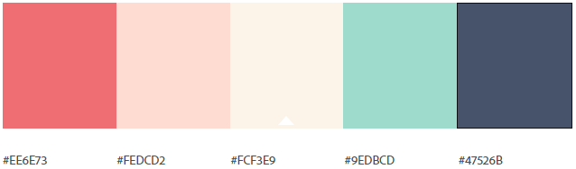
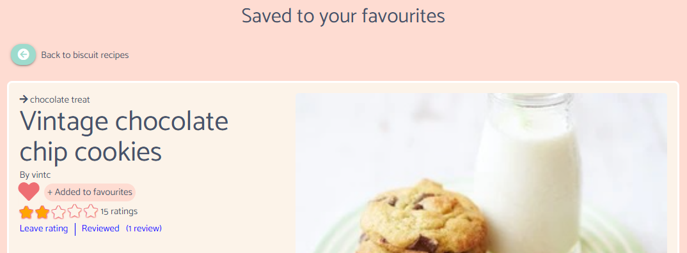
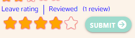
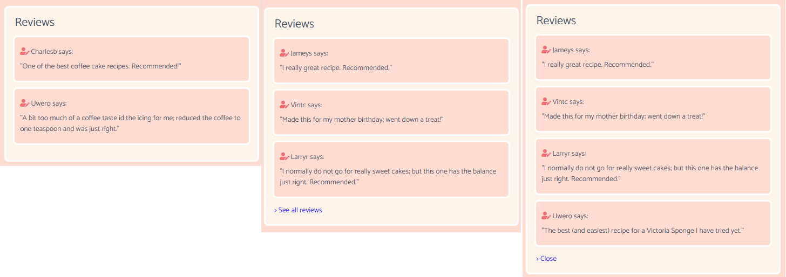

# Community Treats - Readme document

  

### Website can be viewed here: https://community-treats.herokuapp.com/
### Project GitHub site: https://github.com/C-Undritz/Community-Treats
### **Disclaimer: This Website is for educational purposes only.**

---
# Table of Contents
* [OVERVIEW](#overview)
* [STRATEGY](#strategy)
* [SCOPE](#scope)
* [STRUCTURE](#structure)
* [SKELETON](#skeleton)
* [SURFACE](#surface)
* [TECHNOLOGIES USED](#technologies-used)
* [TESTING](#testing)
* [NOTED DESIGN CHANGES](#noted-design-changes)
* [FEATURES](#features)
* [FURTHER DEVELOPMENT](#further-development)
* [DEVELOPMENT AND DEPLOYMENT](#development-and-deployment)
* [CREDITS AND THANKS](#credits-and-thanks)

---
># **OVERVIEW**
Online communities are groups of people who share knowledge and ideas on a common interest. Contributing, enabling and growing online communities gets a company involved with their target audience which can increase brand awareness.  People who already have a vested interested in the topic or content you’re promoting will be exposed to your brand, website and business. As a result, your business will be etched in their mind—much more so than a competitor who doesn’t contribute to the said community.

Creating and/or hosting relevant content will drive relevant traffic to your site; and lessen click through traffic.  By attracting relevant traffic (people who are actually interested in what you have to offer or say) to your website, they’re already more likely to purchase. Why? Because people purchase when they’re genuinely interested in something. 

This project is concerned with the build of a full-stack site that showcases full CRUD functionality to allow a user to view, manage and contribute to a baking recipe dataset.  The site is called 'Community Treats' which is associated with a fictional company called 'Mix'n Bowls' who need to increase brand awareness.  The project showcases the use of current technologies to deliver backend content to the user and present the data in an attractive responsive and user friendly fashion.

---
># **STRATEGY**
Mix'n Bowls is a small company that has enjoyed some high street success and is now due to launch its online commercial store within the next few months.  Mix'n Bowls has had presence on the main social platforms for a number of years, however, in the run up to their commercial website launch, they now want to also create an intimate community where their brand is front and center to the users and customers of the site.  

'Community Treats' by Mix'n Bowls is the answer to this.  It is a community website extension to the retail website that allows users to upload baking recipes and view others uploaded from other community members.  The aim is to grow an online community to promote home baking, increase company and product awareness which will convert into sales of the latest Mix'n Bowls products.

Increasingly baking attracts people from a number of demographics due to the popularity of baking programmes like 'The Great British Bake-off' and also more recently due to the global pandemic.  Therefore the website is designed to be attractive to a broad spectrum of users and abilities.  The sites uses mainstream current technologies to deliver a streamlined user experience that is responsive across devices.  

# User Stories

As the site buiness owner I want to:

* *Raise awarenes and promote the Mix'n Bowls brand prior to commercial website launch*
* *link to the commercial website to promote Mix'in Bowl products that could be used for the recipes*
* *Administer the site through an admin login to manage content*

As a first time user of this software I want to be able to:
* *Easily navigate and use the site on any device*
* *View baking recipes across a number of categories*
* *Find easily a recipe through search functionality*
* *Set up an account*
* *Rate and review recipes*
* *See and read other users opinions and views on the recipes*
* *Contact Mix'n Bowls to report issues and/or provide feedback*
* *Link through to the main social media sites from the website*

As a returning user of this software I want to be able to:
* *Login and have a personalised experience*
* *Upload my recipes*
* *Update and delete my recipes*
* *Save recipes that I like as favourites*
* *Update my profile details*

---
># **SCOPE**
# Content
## The presentation of the site is concerned with:
1.	Being attractive and engaging from the outset to encourage the user to explore the site.
2.	Being simple in presentation and use; the focus of the site is the creating, reading (viewing), updating and deleting (CRUD) the content.   

## Functional Requirements
1.	To be viewing a recipe within a couple of clicks/taps
2.	Mobile first; the site is designed to work on mobile and tablet screens first, but responsive design ensures that it scales up and looks good on laptop and desktop screens. 
3.	Flexible Navbar and site options to reflect a logged in user and admin user to restrict some functionality of the website.
4.	Login button (with hint to register) on the landing page to encourage users to register for additional functionality.
5.  Functionality for user to create, edit and delete recipe content 
5.  Interactive functions for user to provide feedback on a recipe and to view feedback provided by others.
5.	A contact function/form that will allow the sending of feedback to an existing email using JSMail.
6.	Clear and obvious links to social media platforms.
7.	Feedback animations to provide players with clear interaction cues.

---
># **STRUCTURE**
The website is broadly separated into three sections:
* Sections and functions accessible whilst not being logged in:
  * Free text search
  * Search by type
  * Search by Category
  *  View recipes   

* Sections and functions accessible when registered and logged in:
  * All of the above
  * My Page, consisting of the user recipes, favourites and abililty to change registered details.
  * Ability to create a recipe, edit and delete it.   

* Sections and functions accessible when logged in as an admin user:
  * All of the above
  * Admin functions consisting of managing types and categories (create, edit, delete) and abiilty to add another admin role.   

# Navigation
Navigation of the site content is facilitated by:
1. Navigation Bar fixed at the top of each page and always displayed when the user scrolls and displays links depending on logged in / out status.
2. Navigation buttons with associated navigation information  displayed at the top of pages so that the user can go back to the previous page.
3. Call to action button on the landing page that will ask the user to login or direct them to register if not already a registered user.
4. A free text search field to allow first time visitors or registered users to start searching for specific keywords straight away.
5. Images related to the type of recipes that can be found on the site presented as links on the main page, so first time visitors or registered users can query recipes by type. 
6. A user 'My Page' which will feature the recipes uploaded by the user and their favourites so they can navigate to them directly

[Website User Journey v1](assets/readme/community_treats-website_user_journey_v1.pdf)

# Database Schema

# Searching
There are a three ways for the user to interrogate the recipes document collection:
## Using the free-text search: 
Allows the user to search for documents within the recipes collection against the below fields using a text index type:
  * recipe_title
  * description   

## Displaying all recipes by 'Type':  
Completed by clicking on one of the 'type' boxes on the landing page.
   

## Displaying all recipes by 'Category':  
Completed once results have been returned from a type search.  User can select a category from the drop down search box.  This will then return a list of recipes against that type AND that category.  

---
# Consistent Features between pages
Each page has a responsive fixed navigation bar with the same links that reflect whether a resgistered user is logged in or not.  The navigation links are justified to the right and a logo is justified left that links to the home page.  

A footer is present on every page with social media icons linking to the Facebook, twitter and Instagram

---
># **SKELETON**
# Wireframes
* [Mobile v0.1](assets/readme/community_treats_mobile-wireframe_v0.1.pdf)
* [Desktop v0.1](assets/readme/community_treats_desktop-wireframe_v0.1.pdf)

The final design closely matches the wireframes completed at the outset of the project.  Where there are changes, this is detailed in the 'noted design changes' section below.

---
># **SURFACE**
# Theme
The website look and feel is consistent throughout, the ease of which is achieved through the use of Jinja templating, Materialize framework and custom CSS. 

The aim is for the site to be simple yet engaging from the outset to encourage the site visitor to explore further.  The pastel colour scheme, font choice and banner should leave the user in no doubt as to the content and purpose of the site.  

# Colours
The colours selected for the wesbite are pastel like colours.

# Text
## Fonts
* [Mystery Quest](https://fonts.google.com/specimen/Mystery+Quest?preview.text=Community%20Treats&preview.text_type=custom#standard-styles):
Used  on the landing page only for the site name in the banner and for the text of the search type boxes

* [Catamaran](https://fonts.google.com/specimen/Catamaran?query=Catamaran&preview.text=Community%20Treats&preview.text_type=custom): Used for all other text throughout the website.

## Font color
* The colours FEDCD2 and EE6E73 were used when ever Mystery Quest was used.
* The colour #47526B was used for all other content text.
* Plain white (#FFFFFF) was used for button text and icons, and in the desktop navbar links.

# User interaction feedback
## Buttons
All of the buttons used throughout the site change from #9EDBCD to #EE6E73 when moused over.

## Links
Where links from text are used, the well know blue text used throughout the web is used.  These underline when moused over.

---
># **TECHNOLOGIES USED**
* HTML5
* CSS3
* JavaScript 
* Python
* Flask web application framework
* Jinja template engine for Python
* Werkzeug [WSGI](https://wsgi.readthedocs.io/en/latest/) web application library
* PyMongo
* MongoDB
* Materialize framework
* Heroku
* Gitpod
* GitHub
* EmailJS
* Google Fonts
* Font Awesome
* Balsamiq
* Canva (to create the logo)
* Lucidchart
* https://favicon.io/ (for generating 32x32 favicon)

---
># **TESTING**
Testing completed is detailed in the [TESTING.md](TESTING.md) document

---
># **NOTED DESIGN CHANGES**
# Changes to original design
## Banner
* The banner only features on the landing page.  Having it on every page was a poor UX on mobile devices where the user had to scroll down everytime by default.
* 'My Page' and 'Add recipe' buttons are not shown on the banner once user logged in.  These are accessed from the navbar.  

## My Page
* There are now five buttons featured within the My Page.  In addition to the 'View favourites' and 'View My Recipes' buttons, there are now the 'Add recipe', View/Edit Profile' and 'Change Password' features. 

## Display of recipes selection following a search
* It was planned that the recipes would show on small cards that would place side by side at larger resolutions and stack at lower resolutions.  However this was a challenge to implement due to differing length of content, which meant that card height differed at various resolutions. Therefore it was determined that at all resolutions, the recipe results would stack.

## Category search
* This was meant to be presented as further click boxes upon the return of the search results by type. However it was found that the 'category' value was not able to be passed to the database along with the 'type' value to return the results.  However it could be extracted from a form during a POST function and passed with the 'type' value to the back end. Therefore this was implemented as a dropdown input field with a submit button. 

## Add recipe
* The add category button was not able to be implemented and three category input fields are displayed with only the first 'required' and the other two optional.  This was because the add button functionality (used successfully to add ingredients and instructions), was not able to be used with the Jinja templating required to populate the dropdown content.

# New features
These are listed below and expanded upon in the 'features' section:
* Recipe ratings
* User Reviews of recipes
* Editing profile and password
* Creating an admin role

---
># **FEATURES**
# Security
The website has the following features that help to maintain security so that manipulation of the URL will not allow users to access to restricted areas or other users profiles/privileges.
* Login_required decorator function: Added to python functions so as to ensure that a user is in session (logged in) to access the wrapped features delivered by certain python functions. 
* Admin_required decorator function: Added to python functions that require admin privileges to access and so ensures that the user is an admin user.
* Edit recipe author check:  If another users username is known, it would be very easy to edit one of their recipes by inserting the username and the recipe id into the URL.  A check is in place so that editing a recipe will require the session user id to match the 'created_by' database recipe document value.
* The register, update profile and create admin role functions all check for duplicate usernames and emails, to ensure that the same username and email cannot be used to create or update a profile.
* The register, update profile and create admin role functions all require that the password is entered twice.  A custom javascript function checks whether these match and displays a message accordingly.
* '404 page not found' page

# Data Management
## Database Updates: 
The database generated document id's are used to reference relationships between documents from different collections within the database.  This ensures that should any details change within a document (such as username, type_name or category_name) that the front end will display the updated details automatically.

## Database Deletes: 
Within the front end interface only types, categories, favourites and recipes can be deleted.

### Delete Type: 
Recipes are discoverable by primarily discoverable by type.  If a type is deleted then it will not feature on the landing page and therefore no recipes will be displayed against this type or feature in the category search.  They will still be returned and accessible from a free text search and in the users list of recipes within 'My Page'.  A recipe without a type will need to assigned a new type within the edit recipe function and the owner needs to be made aware of the issue.  

Therefore if a type is deleted all recipes associated with that type is assigned a new type: 'unclassified'.  If a recipe has the 'unclassified' type, then a message is displayed against that recipe within the user recipe list highlighting this issue so action can be taken.

### Delete Category:
A recipe must have one category and can optionally have an additional two.  

When a category is deleted also be removed from the category array of any recipe that has been recorded against the deleted category.  Therefore it will not feature above the recipe title when viewing that recipe.

### Delete Recipe:
Reviews and favourites are the only collections that reference information from a recipe document and are therefore no use when a recipe is deleted.  Therefore any review or favourite documents that reference the deleted recipe are also removed in the same delete action.

# Add and Edit recipes
## Additional Ingredients and Instructions:
Additional ingredients are added using the 'add ingredient' and 'add instruction' buttons.  The added input fields can then be removed again by clicking on the 'bin' icon that appears with the field.

Unlimited additional input fields for additional ingredients and instructions is allowed, however once added they are required.

When editing a recipe, all ingredient and input fields display with a 'bin' icon and so all can be deleted if required.  However there is a check when submitting so that there are at least two ingredients and instructions when submitting a recipe edit.

# Recipe View
## Categories
The categories against which the recipe is associated are displayed above the recipe title.

## Favourites
The user has the ability to favourite and un-favourite a recipe from within the recipe view and is represented by a heart icon.

Adding a favourite can only be done when logged in; if a user is not logged in then clicking the heart will result in a modal asking the user to login or register:

If a recipe is not a favourite the heart appears un-filled.  When a user clicks on the heart in this state, the recipe is added to their favorites and the heart in then filled.  A new document is then added to the favourites collection to record this action.

If a recipe is a favourite the heart appears filled.  When a user clicks on the heart in this state, the recipe is removed from their favourites and the heart is un-filled.  The document is removed from the favourites collection.

In both cases the associated tool-tip message changes to suit the situation.

## Ratings
Originally it was not planned to implement a ratings function.  However, as development progressed, this became a possibility.  Submitting a rating does not require the user to be logged in and is not tied to the review functionality.  The thinking behind this is that more users will be inclined to rate the recipes if they do not have to have an account and have to be logged in, or have to write a review to leave a rating.  This does present the risk that the ratings could be abused, however it is hoped that the baking community is well behaved!  The restriction that the author cannot rate or review their own recipe is implemented.

The user can rate the recipe from within the recipe view and is done by selecting a star within an array of five.  This is accessed by clicking 'Leave review' text near the top of the view recipe page.  This makes the star array appear with a submit button; the submit button is disabled until a rating is selected.  The array is responsive with the stars filling and unfilling with mouseover interaction and then permanently filled/unfilled once a rating is selected at which point the submit button is enabled.  The chosen rating can be updated by clicking on another star or can be reset by another mouseover.

If there are no ratings for the recipe then text displays stating as such.  Once a rating is added then the current rating is displayed as a star array with the amount of stars filled representing the current rating average.  The number of ratings displays alongside the star array.

If the user viewing the recipe is the author then the 'Leave rating' text is not displayed so as to prevent the author rating their own recipe.

## Reviews
### Submitting a review
Originally it was not planned for review functionality.  However, as development progressed, this became a possibility. 

The user can review the recipe from within the recipe view and is done by clicking on the 'leave review' text near the top of the view recipe page.  This results in a modal displayed with a text box and submit button. 

If a user is not logged in then this will result in a modal asking the user to login or register (as shown above).  If a logged in user has already reviewed a recipe then the 'Leave review' text is replaced by 'Reviewed' and upon clicking this a modal appears stating that they have 'already reviewed this recipe'.

If the user viewing the recipe is the author then the 'Leave review' text (and therefore the 'Reviewed' text), is not displayed so as to prevent the author reviewing their own recipe.

### Viewing reviews
Reviews for a recipe are displayed at the foot of the recipe view.  Thay can be reached by scrolling, or clicking on the 'review count' next to the 'Leave review' text, which will automatically scroll the page down.  Up to three of the latest reviews are displayed by default; any more reviews are hidden and require that the user clicks on '> See all reviews'.  The user can then return to the display of the original three by clicking on '> Close'.  These links are only displayed if the review count is more than three.

# Admin role
Admin privileges are determined by a boolean value against 'admin' key within the user database document.  When a user registers, the value for this key is 'false' by default.

If a user has admin privileges then an additional option button is available for them within 'My Page': 'Admin functions', which when clicked displays three option buttons:
* Manage Types: Add new types, and edit / delete existing
* Manage Categories: Add new categories, and edit / delete existing
* Create Admin role:  Exactly the same as the register function however the value for the admin key within the user document is 'true' when using this function.  So allowing the new user to have admin privileges.

# Edit profile / password
The ability to edit a profile and password is presented as two options within 'My Page'.  When editing a profile, the admin and password values are preserved during the edits and so are not changed.  

---
># **FURTHER DEVELOPMENT**
The below are planned for future development:

1) Modify account to give admin privileges:  Currently a new account needs to be created to give admin privileges.  It is planned that a current admin role could modify an existing login to give admin privileges.

2) Admin moderating function for review of recipes: Allow admin access to access recipes and update or delete them if they are considered a duplication or have elements that are deemed inappropriate.

3) Admin management of type ‘classified’ recipes: Currently the only way to deal with recipes that are of type ‘classified’ as a result of a type deletion is for the author to edit these.  This planned function would return all recipes that are of type ‘classified’ and allow the admin role to re-assign these through a streamlined interface.

4) Update / delete reviews: Currently when a review is submitted it cannot be modified or deleted.  Two future planned features would change that:
    * Allowing a user to access their submitted reviews from their ‘My Page’ and be able to modify and /or delete them.
    * An admin moderating function that will allow an admin access to all reviews and be able to delete them only if they are deemed inappropriate.
  
5) Pagination was attempted during the project was implemented with partial success (see TESTING.md).  However there were issues with it related to the free text and category search which were not able to be solved and was therefore removed.  It is planned for future development to implement pagination functionality.

6) The cooking images are added to be displayed with the recipe by the user pasting a URL into the relevant inpur field on the add recipe form.  It is planned for an image upload functionality (such as that offered by Cloudinary) will be implemented in the future.

7) Improve the lighthouse scores returned by acting on the feedback recommendations.

---
># **DEVELOPMENT AND DEPLOYMENT**
* A repository was setup in GitHub using the Code Institute Gitpod [full template]( https://github.com/Code-Institute-Org/gitpod-full-template).
* Development was completed using Gitpod and code was regularly pushed back to the GitHub repository.

# Website deployment
# Running the project locally

---
># **CREDITS AND THANKS**
# Code
* Icon and button hover animations from [https://ianlunn.github.io/Hover/](https://ianlunn.github.io/Hover/) .  Made available for personal/open source use under a MIT license.
* Text outline for website name in the banner taken from the section 'Using text-shadow property' found on [codesdope.com](https://www.codesdope.com/blog/article/adding-outline-to-text-using-css/)
* Changing the colour of the Materialize form underline input, label and icon found on [stackoverflow](https://stackoverflow.com/questions/37127123/change-color-of-underline-input-and-label-in-materialize-css-framework)
* Article "How to add an event listener to multiple elements in JavaScript" from [flaviocopes.com](https://flaviocopes.com/how-to-add-event-listener-multiple-elements-javascript/)
* HTML Pattern property for email RegEx was learnt from [www.w3schools.com](https://www.w3schools.com/tags/att_input_pattern.asp) 
* For footer tips: [Easy sticky footer - stop a footer from floating up a short page! by Kevin Powell](https://www.youtube.com/watch?v=yc2olxLgKLk&t=217s)
* HTML form input step attribute from [www.w3schools.com](https://www.w3schools.com/tags/att_input_step.asp)
* For the stars on the user rating interface the page 'Change color of element onMouseOver using javascript' found on [stackoverflow](https://stackoverflow.com/questions/21184932/change-color-of-element-onmouseover-using-javascript/21185008) 
* Toggle (Hide/Show) an Element from [w3schools.com](https://www.w3schools.com/howto/howto_js_toggle_hide_show.asp)
* Smooth scrolling with html page between anchors from [css-tricks](https://css-tricks.com/snippets/jquery/smooth-scrolling/)
* Reminder on how to replace special characters in a list here [stackoverflow.com](https://stackoverflow.com/questions/13207697/how-to-remove-square-brackets-from-list-in-python)
* How to modify the styles of the Materialize tooltip found here [stackoverflow.com](https://stackoverflow.com/questions/33593605/materialize-css-tooltip)
* The implementation of the login required decorator function from [pythonprogramming.net](https://pythonprogramming.net/decorator-wrappers-flask-tutorial-login-required/)
* Thanks to Sean Young_lead for help on the JavaScript for the add and remove of the ingredients and instruction fields on the add and edit recipe pages.
* Thanks to BenKav_lead for help using the mongoDB '$set' field update operator. Ben pointed out that I needed to reference the mongoDB document again within the request to the database (see below)

* Thanks to Ed B for making me aware of the Flask error handler for catching a 404 error.

# Images and Content
## Images
The images listed below were gratefully offered free for commercial use from Pixabay with no attribution required: 
* French Macarons banner image: https://pixabay.com/photos/macarons-french-macarons-sweets-5613355/
* Comical chef image for 404 and 500 error pages:
https://pixabay.com/photos/cooking-figure-funny-restaurant-3139945/
* Cakes type image: https://pixabay.com/photos/cupcakes-chocolate-dark-dessert-1452178/
* Breads type image: https://pixabay.com/photos/bread-food-baked-artisan-breads-399286/
* Biscuits type image: https://pixabay.com/photos/heart-cookies-biscuits-sugar-baked-166918/
* Tray Bake type image: https://pixabay.com/photos/chocolate-brownies-brownies-cake-668624/
* About us page baking equipment image: https://pixabay.com/photos/valentine-s-day-baking-1955254/
* About us page ingredients image: https://pixabay.com/photos/flour-almonds-food-healthy-3636553/
* Under construction full page background image: https://pixabay.com/photos/chef-flour-dough-baking-5813413/

About us page books image: By Christopher Undritz

The navbar icon and favicon was downloaded from uxwing.com and is free to use for any personal and commercial projects without any attribution or credit: https://uxwing.com/wedding-cake-icon/

## Content
* Information for Readme Overview section was found in the following website:
	* [Sendible.com article: 5 ways to use Online Communities to Promote your Content](https://www.sendible.com/insights/online-communities-for-content-promotion)

# Acknowledgments
* Thanks to the excellent CI Slack community for constant support, help, and valuable feedback.  Particularly Ed B, BenKav, Sean Young and Daisy_mentor.
* Thanks to Code Institute for the excellent course content (referenced many times).
* Thanks to my mentor Adegbenga Adeye for his feedback, help and support throughout this challenging third milestone project.