# Community Treats - Testing document

## [Associated Readme document](README.md)

---
# Table of Contents
* [RESPONSIVE DESIGN TESTING](#responsive-design-testing)
* [FUNCTIONALITY TESTING](#functionality-testing)
* [QUALITY CHECKS](#quality-checks)
* [USER STORIES TESTING](#user-stories-testing)
* [PROBLEMS AND FIXES](#problems-and-fixes)
* [REMAINING ISSUES](#remaining-issues)

---
># **RESPONSIVE DESIGN TESTING**
Research detailed screen resolutions that are most popular today (see [here](https://kinsta.com/blog/responsive-web-design/#common-responsive-breakpoints) and [here](https://www.browserstack.com/guide/responsive-design-breakpoints)).  This information was used along with the required resolutions for [am-i-responsive](http://ami.responsivedesign.is/) to determine 17 resolutions as a guide for media breakpoints and to test for responsive design using Google Chrome DevTools. The resolutions tested were:

    * 1920 x 1080
    * 1600 x 992
    * 1536 x 864
    * 1366 x 768
    * 1280 x 802
    * 1366 x 768
    * 768 x 1024
    * 540 x 720 (Surface Duo)
    * 414 x 896
    * 411 x 731 (Pixel 2)
    * 411 x 823 (Pixel 2 XL)
    * 375 x 812 (iPhone X)
    * 375 x 667 (iPhone 6/7/8)
    * 360 x 720
    * 360 x 640
    * 320 x 568 (iPhone 5)
    * 320 x 480

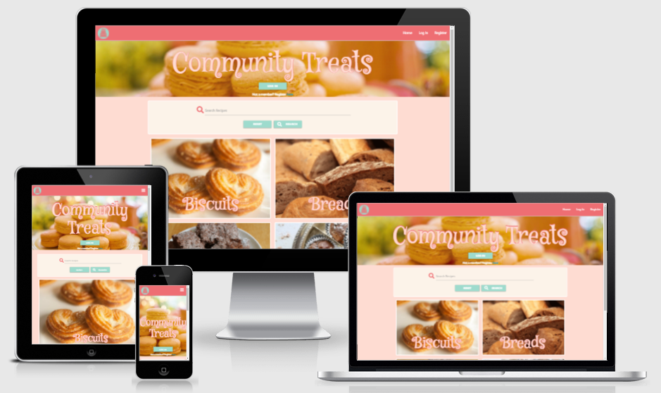
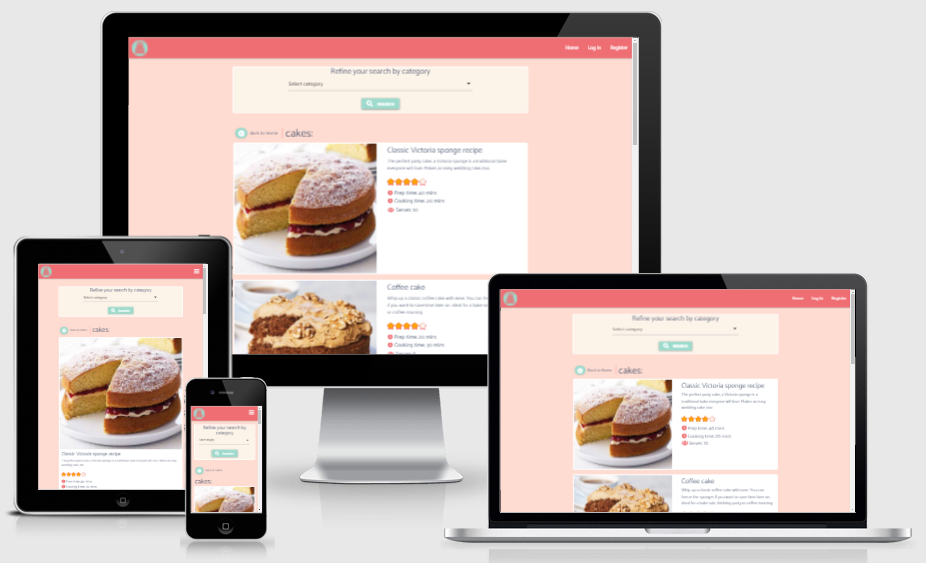
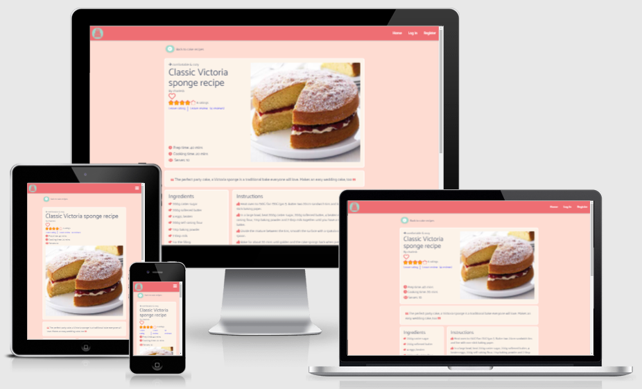

The responsive design test sheets and results can be viewed using the below link.  

* [Community Treats Responsive Design test results](asseets/readme/responsive_design_test_resuts.pdf)

For each resolution each page was tested to ensure that all text can be viewed and that all features of the page can be seen and do not overlap.

Also successfully tested the live site on the following devices:
* Huawei P smart 2019 smart phone
* Samsung A12 smart phone 
* Laptop at 1920 x 1080 resolution
* Amazon Fire HD 8 tablet
* Apple iPad 7th Generation
* Apple iPhone 8

---
># **FUNCTIONALITY TESTING**
Functionality testing of all of the implemented CRUD functionality was completed to ensure that all Jinja conditional statements, display of database content, modals, navigation and the update of database records worked correctly and as expected.  This was conducted on a desktop PC using Google Chrome dev tools

The functionality test sheets and results can be viewed using the below links:
* [CREATE - Register](assets/readme/.pdf)
* [CREATE - Admin role](assets/readme/.pdf)
* [CREATE - Add recipe](assets/readme/.pdf)
* [CREATE - Rate recipe](assets/readme/.pdf)
* [CREATE - Add favourite](assets/readme/.pdf)
* [CREATE - Review recipe](assets/readme/.pdf)
* [CREATE - Add new type](assets/readme/.pdf)
* [CREATE - Add new category](assets/readme/.pdf)
* [READ - The view recipe screen](assets/readme/.pdf)
* [READ - Ratings test](assets/readme/.pdf)
* [UPDATE - Edit a type](assets/readme/.pdf)
* [UPDATE - Edit a category](assets/readme/.pdf)
* [UPDATE - Edit a recipe](assets/readme/.pdf)
* [UPDATE - Edit a profile](assets/readme/.pdf)
* [UPDATE - Edit a password](assets/readme/.pdf)
* [DELETE - Delete recipe](assets/readme/.pdf)
* [DELETE - Remove favourite](assets/readme/.pdf)
* [DELETE - Delete type](assets/readme/.pdf)
* [DELETE - Delete category](assets/readme/.pdf)  
 

># **SECURITY TESTING**
Security testing was conducted to test that any areas of the website that require a login or admin privileges cannot be accessed by manipulation of the url. 

The security test sheet and results can be viewed using the below link:
* [Security tests]()  
 

---
># **QUALITY CHECKS**
# Approach
## CSS style sheet:
The following quality checks were completed on the css style sheet (style.css):
* Manual review on comments against code to ensure relevancy.
* Manual review to ensure all quoted-out code was removed.
* Manual check of the spacing between code lines.
* Code run through [Autoprefixer](https://autoprefixer.github.io/) to ensure compatibility across browsers.
* Code checked on [W3C CSS validation](https://jigsaw.w3.org/css-validator/) using direct input.

## HTML:
The following quality checks were completed on each of the four HTML files:
* Manual review on comments against code to ensure relevancy.
* Manual review to ensure all quoted-out code was removed.
* Manual check of the spacing between code lines.
* Code checked on [W3C Markup Validation](https://validator.w3.org/) using direct input.  Due to the Jinja template code within the HTML this was done by opening each page, right clicking and selecting 'view page source', and then copying the HTML code displayed for direct input.

## JavaScript:
The following quality checks were completed on each of the three JavaScript files:
* Manual review on comments against code to ensure relevancy.
* Manual review to ensure all quoted-out code was removed.
* Manual check to ensure that all console.log entries were removed.
* Manual check of the spacing between code lines.
* Code checked on [JSHint](https://jshint.com/) using direct input.  Note that '//jshint esversion: 6' was entered at the top of the code window prior to pasting in JS code. This ensures that the feedback received from JSHint takes into account that the JS code uses ECMAScript 6 specific syntax.

## Python:
The following quality checks were completed on the app.py file:
* Manual review on comments against code to ensure relevancy.
* Manual review to ensure all quoted-out code was removed.
* Manual check to ensure that all print() entries were removed.
* Manual check of the spacing between code lines.
* Addressing all PEP8 non-compliancy flags in Gitpod.
* Code checked on [pep8online.com](http://pep8online.com/)

## Website performance:
The site performance was tested on the following browsers by using Lighthouse :
* Chrome
* Opera
* Edge
* Firefox

N.B: Internet Explorer was not tested as the site uses ES6 so it's not fully compatible with Internet Explorer builds.

---
# Results
## W3C CSS Validation:
* Errors: No errors found
* Warnings: 74 reported and no action taken as these were all related to the vendor extensions added by running the css through Autoprefixer.  So no action was taken to remove these.

## W3C Markup Validation:
* 404.html - No errors or warnings to show.
* 500.html - No errors or warnings to show.
* about.html
* add_category.html - No errors or warnings to show.
* add_recipe.html - No errors or warnings to show.
* add_type.html - No errors or warnings to show.
* admin_category_display.html - No errors or warnings to show.
* admin_functions.html - No errors or warnings to show.
* admin_type_display.html - No errors or warnings to show.
* base.html - N/A
* contact.html
* create_admin.html - No errors or warnings to show.
* edit_category.html - No errors or warnings to show.
* edit_password.html - No errors or warnings to show.
* edit_profile.html - No errors or warnings to show.
* edit_recipe.html - No errors or warnings to show.
* edit_type.html - No errors or warnings to show.
* index.html - No errors or warnings to show.
* login.html - No errors or warnings to show.
* profile.html - No errors or warnings to show.
* recipe_display_category.html - No errors or warnings to show.
* recipe_display_favourites.html - No errors or warnings to show.
* recipe_display_search.html - No errors or warnings to show.
* recipe_display_type.html - No errors or warnings to show.
* recipe_display_user.html - No errors or warnings to show.
* register.html - No errors or warnings to show.
* under_construction.html
* view_recipe.html - No errors or warnings to show.

## JSHint:
* add_recipe_script.js
* all_reviews_script.js
* edit_recipe_script.js
* password_check_script.js
* script.js 
  * Four unused variables
    * instances_sidenav
    * instances_form
    * instances_modal
    * instances_tooltip   

  These are from the Materialize required Javascript for the sidenav, interactive forms, modals and tool tips and are required for this functionality to work and have been implemented as required. Therefore no action taken in regards to this feedback.

* contact_us_script.js: 
    * One unused variable - line ?: 'sendMail'.
    * One undefined variable - line ?: 'emailjs'.

        These are required for the EmailJS service to work and have been implemented as required.  Therefore no action taken in regards to this feedback.

## Python PEP8:
* Code passed a PEP8 compliant by pep8online.com.  However there was one red flag in Gitpod shown below.  This was because the env python file was not pushed to GitHub.  So to avoid an error once the app is deployed to Heroku, the env file will only be imported if the os is able to find an existing file path for the env file itself.

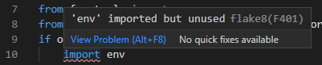

## Lighthouse results:
### Chrome:
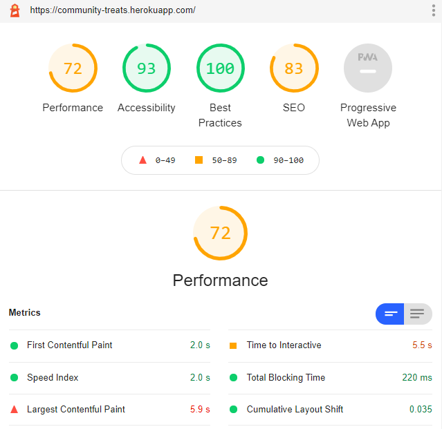
### Opera:
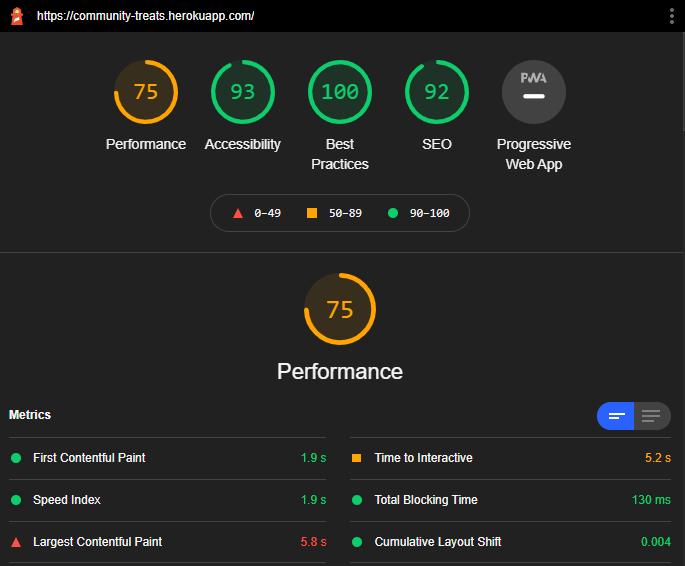
### Microsoft Edge:
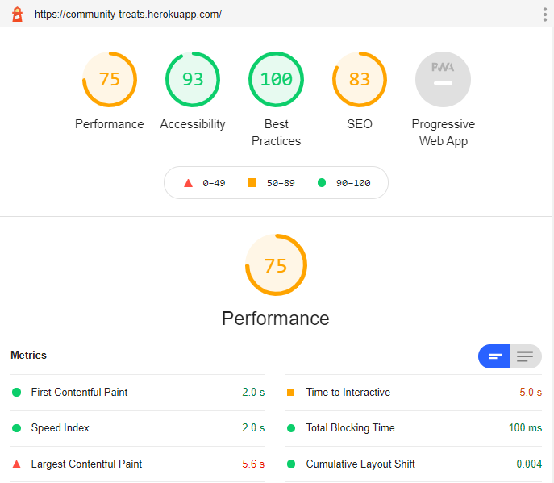
### Firefox:
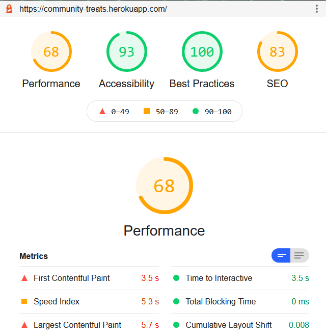

Brief testing on Safari browser was conducted by using the website on a relatives iPad.  The website functioned as expected and no problems observed.

---
># **USER STORIES TESTING**
The below details how the website meets the requirements of each user story. 

## Business Owner
### 1. *Raise awarenes and promote the Mix'n Bowls brand prior to commercial website launch*
* An about us page is accessible from the navbar and this details a brief history of Mix'n Bowls and their next steps into online commerce.  It also has three promotional sections that details the three product ranges offered by Mix'n Bowls: Baking equipment, baking ingredients and books.
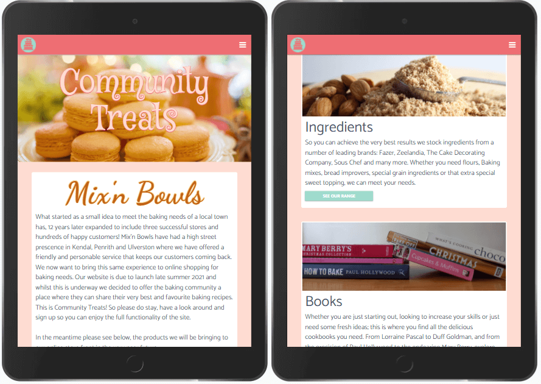

### 2. *link to the commercial website to promote Mix'in Bowl products that could be used for the recipes*
* From each of the product promotional sections there is a 'See our range' button, that at the moment directs the user to a page under construction.  Eventually it will link to a page that displays a range of products that can be purchased.  

### 3. *Administer the site through an admin login to manage content*
* Admin users can be easily created and will have secure access to the Admin functions from their 'My Page'.  Admin functions allow for the management of 'types', 'categories', and also add new admin roles.

## First time user of the software:
### 1. *Easily navigate and use the site on any device*
* Responsive design is employed across all pages to deliver a satisfying UX on mobile, tablet, laptop and large desktop PC displays. See screenshots in 'Responsive Design Testing' above.  
* The Nav bar is displayed at the top of the site on any platform on each page.
* The logo (in the top left) of the nav bar is displayed on each page and links to the home page.
* Navigation buttons and guide text are displayed at the top of most pages that will allow the user to navigate back to their previous page.
* 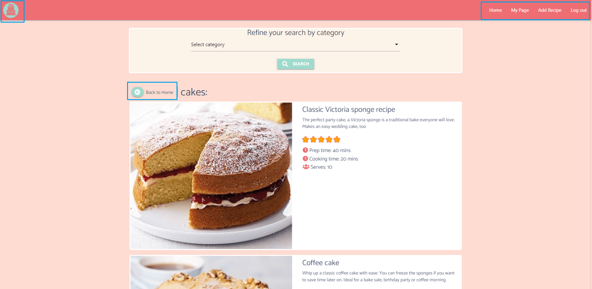
* 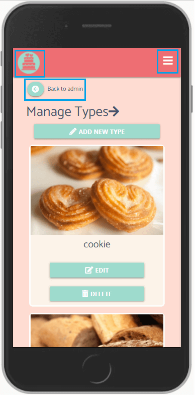

### 2. *View baking recipes across a number of categories*
* Users of the site initially return a search for recipes by a Type by clicking on one of the interactive 'type' boxes on the landing screen:
* 
* User can then refine the results of the Type search by selecting a category from the drop down box:
* 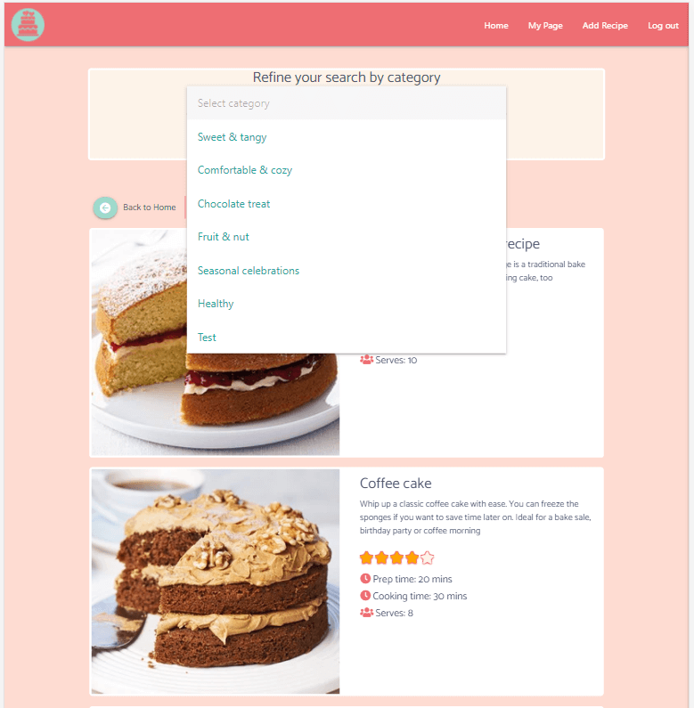  

### 3. *Find easily a recipe through search functionality*
* The website offers three different ways to search the recipe documents collection: free text search, search by type and search by category.  Each of these are clear and allow the users to be viewing a recipe with a couple of click/taps, from the home page.  

### 4. *Set up an account*
* The user is encouraged to login through a call to action button that appears on the banner when a user is not logged in.  Below that is a link to register if they do not have an account.  There is also a link from the log in page to the register page and vice versa.  The register page can also be accessed from the navbar.
* The register page is also minimal asking for only a few details.  The user has to enter the password twice to ensure that they are happy with it and feedback is in place to warn when the entries match / do not match.
*   
* 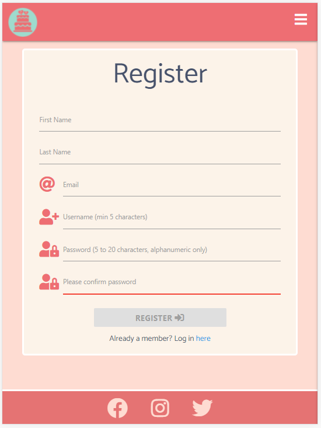  

### 5. *Rate and review recipes*
### 6. *See and read other users opinions and views on the recipes*
* Users can rate a recipe through an interactive star array that allows them to rate a recipe out of five.  Once a rating is added then the current rating is displayed as a star array with the amount of stars filled representing the current rating average. The number of ratings displays alongside the star array.
* 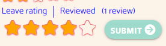  
  
* A logged in user can also leave a review for a recipe which is then displayed at the bottom of the view recipe screen when that recipe is displayed.
* 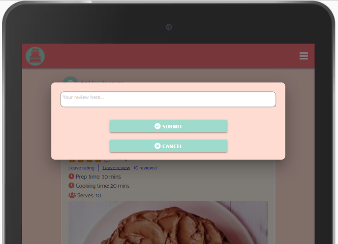
* 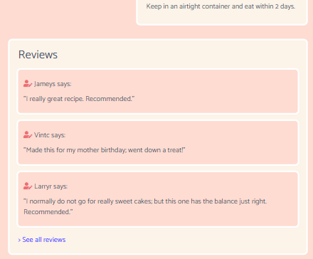  

### 7. *Contact Mix'n Bowls to report issues and/or provide feedback*
* A contact us page is accessible from the envelope icon in the footer.  The contact page has been implemented to work through EmailJS. 
* 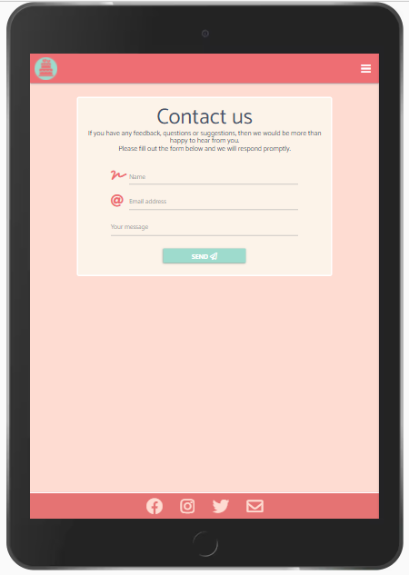

### 8. *Link through to the main social media sites from the website*
* links to social media sites facebook, instagram and twitter are found in the footer which is present on every page.

## Returning user of the software:
### 1. *Login and have a personalised experience*
* All visitors to the site are invited to register and log in.  Logging in will allow users to view recipes and save recipes as favourites, which can then be accessed from their profile page called 'My Page'.  Here they can also update or delete recipes that they have uploaded, and modify their profile and login details.
* 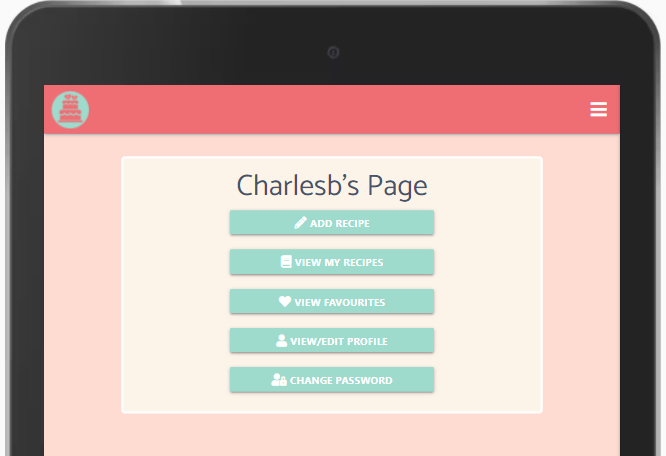  

### 2. *Upload my recipes*
* A logged in user will be able to access the 'add recipe' functionality either through the navbar or from their 'My Page'.  The add recipe function allows user to select a type and categories for their recipe and add as many input fields for ingredients and instructions as necessary.  Adding an image to their recipe is done through pasting a URL link to the recipe image. 
* 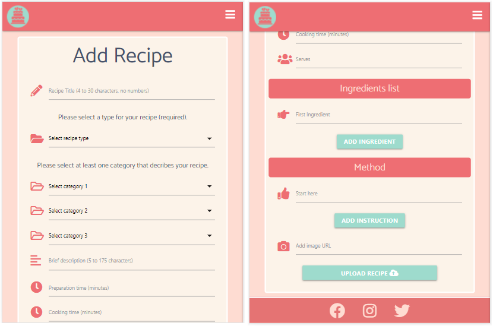  

### 3. *Update and delete my recipes*
* The option to 'view my recipes' within 'My Page' takes the user to a list of their recipes which are displayed alongside two buttons: 'Edit' and 'Delete'.  The user can click on the image of the recipe to view it, or click on the edit or delete buttons to carry out those actions.
* 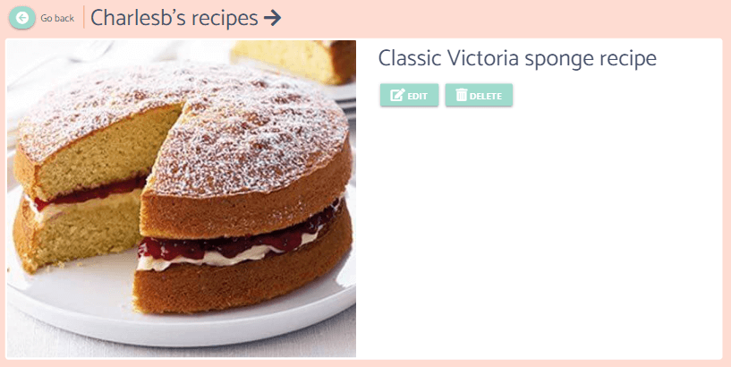 
* The delete function is faciltated through modal and any reviews or favourites associated with that recipe will also be deleted.
* The edit function is facilitated by a page similar to the add recipe page, where the user can delete and update any of the saved information  

### 4. *Save recipes that I like as favourites*
* A logged in user can favourite a recipe whilst viewing a recipe by clicking on the 'favourite heart' icon.  An unfilled heart icon indicates that it is not a favourite, where as a filled icon indicates that it is a current favourite.
* 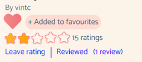 
* The users favourites can then be quickly viewed and accessed from the 'view favourites' button on 'My Page':
* 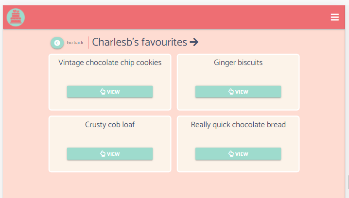  

### 5. *Update my profile details*
* The ability to update profile details can be found two two functions on 'My Page': View/Edit profile and Change password.  
* 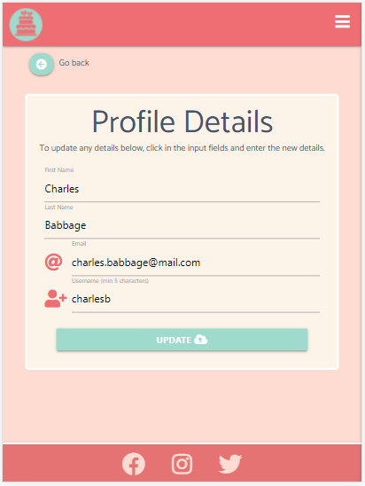 
* 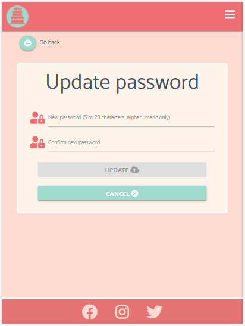  

---
># **PROBLEMS AND FIXES**
## Console errors
* Issue: On the 'add recipe' form, when the buttons to add additional ingredients and additional instructions were clicked, two errors posted in the console:
* 
* *Fix: To solve this the following had to be added to all button elements on the page and those added by the JavaSript functions: type="button".  This solution was found on [stackoverflow](https://stackoverflow.com/questions/22148080/an-invalid-form-control-with-name-is-not-focusable?page=1&tab=votes#tab-top)*

## Comparing _id's with string values
* Issue: The type and category values are recorded in the recipes as the type and category documents _id's but are saved as string values.  Within the edit_recipe.html code when populating the type and category input fields for the drop down list, the recipe.type and recipe.category are compared to the type and category _id values which are not strings. 
* *Fix: To do this, the type._id and category._id had to be converted to a string using the Jinja filter string().*

## Modals in a Jinja loop
* Issue: The modal that triggers when delete selected for recipes and types was needed to be in the loop but that meant the modal was always deleting the first returned record in the loop.  
* *Fix: This was fixed by adding '-{{ recipe._id }}' to the href on the modal trigger and the modal id.  Thanks to Daisy_mentor on slack for the advice on this one.*

## If 'user' in session statement:
* Issue: When the recipe was viewed it was required that the rendering of the favourite icon and also the state of and response of the 'leave review' text reflected whether the current user had already added the recipe to favorites and or reviewed the recipe already.  The functionality for this was working fine when a user was logged in, however the recipe would not display when a user was not logged in.  To gain the current user details two methods were tried and both returned errors:
  
  1) Within the python: current_user = mongo.db.users.find_one({"username": session["user"]})
  2) Within the html file to select the recipe to view: <a href="{{ url_for('view_recipe', recipe_id=recipe._id, username=session['user']) }}" 

  Stating a default parameter value for 'username' when passing it from the frontend to back was tried along with an If-else statement on this value, but an error still resulted.
  
* *Fix: BenKav_lead stated that an if else statement could be used that checked whether the 'user' was in session which solved the issue: *

## Navigation 
* Issue: When adding nav buttons throughout the site for improved navigation problems were encountered as the the user could reach a recipe view by five means: free-text search, results after clicking on one of the the types, results of refining the search by category, from the 'My Page' view recipes and from the 'My Page' view favourites.  Initially, it was planned to call the Flask Python functions for the previous pages, however this was not always possible as the variables were not able to be passed back from the recipe view.  
* *Fix: where possible, the Flask Python function was called.  Where this was not possible the 'History back() method' was used as shown at [w3cschools.com](https://www.w3schools.com/jsref/met_his_back.asp)*

## Delete category values from recipes
* Issue: It was required that the removal of a category from the categories collection also removed any reference to that category from the category array on each recipe document.  A number of database calls were tried using the Mongo DB update many method using the $all array query operator and $pull array update operator, however the desired result was not returned.  This proved to be difficult and so this was posted on stackoverflow.
* *Fix: A kind gentleman advised and helped me work through the problem to gain a solution.  Please see the stackoverflow page [here](https://stackoverflow.com/questions/68237365/mongodb-deleting-an-array-value-in-multiple-documents-in-one-collection-using-p)*

## Selecting drop-down values on an apple device
* Issue: When testing on apple devices it was found that a drop down value could not be selected in the usual way; by tapping on it.  This resulted in the interactive element behind the tapped value being selected.
* *Fix: This was googled and it was found that other users had found this to be an [issue with drop down menu on iOS Safari](https://discussions.apple.com/thread/8356119).  The solution found was to tap the option is the menu with two fingers instead of one.*

---
># **REMAINING ISSUES**
## Pagination

Pagination was implemented using Flask Pagination as below and it worked very well.

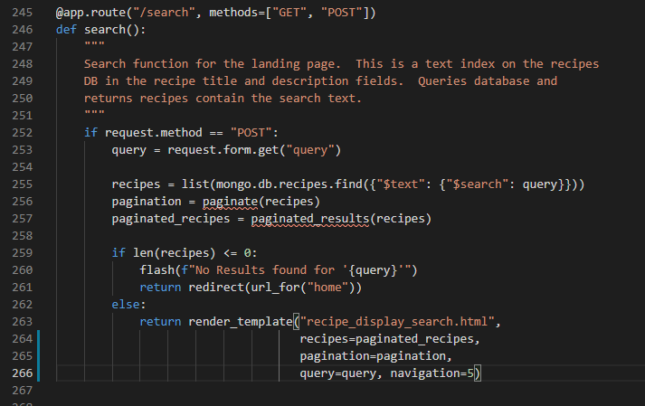

There are four ways to get recipe results from within the application:
1) recipes returned as a result of a free text search,
2) returned as a result of a 'type' search (cakes, cookies, bread etc),
3) returned as a result of a category search (chocolate, tangy, seasonal, etc)
4) As a result of the user searching for only their recipes in the profile page.

Each of these have their own view function and pagination was applied to all.  However testing revealed that it worked for two and not the other two.  The two that do not work properly are where the search parameter comes from an input field that is part of a form which has the POST action.  When performing a search on any of these, the first page is returned with all of the pagination info and links, but click on page 2 or any other pages and a 'TypeError' was returned stating "The view function for 'search' did not return a valid response. The function either returned None or ended without a return statement.A solution to this was not determined during development and so it was removed entirely from the project and moved to an feature for further development.

 