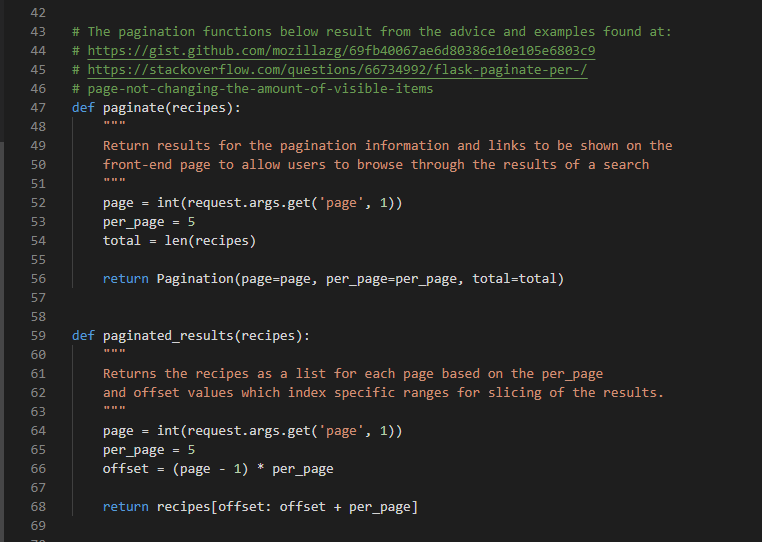
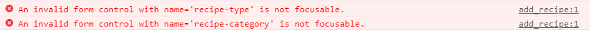

Pagination.
Pagination was implemented using Flask Pagination as below and it worked very well.

There are four ways to get recipe results from within the application:
1) recipes returned as a result of a free text search,
2) returned as a result of a 'type' search (cakes, cookies, bread etc),
3) returned as a result of a category search (chocolate, tangy, seasonal, etc)
4) As a result of the user searching for only their recipes in the profile page.

Each of these have there own view function and pagination was applied to all.  However testing revealed that it worked for two and not the other two.  The two that do not work properly are where the search parameter comes from an input field that is part of a form which has the POST action.  When performing a search on any of these, the first page is returned with all of the pagination info and links, but click on page 2 or any other page and a 'TypeError' was returned stating "The view function for 'search' did not return a valid response. The function either returned None or ended without a return statement."  A solution to this was not determined during development and so it was removed entirely from the project and moved to an feature for further development.

*-----------> ADD THESE TO THE TESTING DOCUMENT WHEN STARTED:
* Issue: On the 'add recipe' form, when the buttons to add additional ingredients and additional instructions were clicked, two errors posted in the console:

To solve this the following had to be added to all button elements on the page and those added by the JavaSript functions: type="button".  This solution was found on [stackoverflow](https://stackoverflow.com/questions/22148080/an-invalid-form-control-with-name-is-not-focusable?page=1&tab=votes#tab-top)
* Issue: The type and category values are recorded in the recipes as the type and category documents _id's.  Therefore in the edit_recipe.html code when populating the type and category input fields the type and category ID's are compared with the recipe.type and recipe.category.  To do this, the type._id and category._id had to be converted to a string using the Jinja filter string(). 
* Issue: The modal that triggers when delete selected for recipes and types was needed to be in the loop but that meant the modal was always deleting the first returned record in the loop.  This was fixed by adding '-{{ recipe._id }}' to the href on the modal trigger and the modal id.  Thanks to Daisy_mentor on slack for the advice for this one.
* Issue: During testing it was found that the edit recipe function was stripping the ratings field from the stored recipe document as 'ratings' was missed in the edit upload.  This was re-added as '"ratings" = [] but of course this removed the current array.  It was briefly considered that the ratings should be stored in a separate collection, however this would be a lot of work over the other idea of extracting the current 'ratings' array as in a variable and re-inserting it back into the document with the edit.
* When the recipe was viewed it was required that the rendering of the favourite icon and also the state of and response of the 'leave review' text reflected whether the current user had already added the recipe to favorites and or reviewed the recipe already.  The functionality for this was working fine when a user was logged in, however the recipe would not display when a user was not logged in.  To gain the current user details two methods were tried:
  1) Within the python: current_user = mongo.db.users.find_one({"username": session["user"]})
  2) Within the html file to select the recipe to view: <a href="{{ url_for('view_recipe', recipe_id=recipe._id, username=session['user']) }}" 

  Both returned errors.  Stating a default parameter value for 'username' when passing it from the frontend to back was tried along with an If-else statement on this value, but a error still resulted.
  
  Solution:  BenKav_lead stated that the following could be used which solved the issue: 

* When adding nav buttons throughout the site for improved navigation.  Problems were encountered as as the the user could reach a recipe view by five means: free-text search, results after clicking on one of the the types, results of refining the search by category, from the 'My Page' view recipes and from the 'My Page' view favourites.  Initially, it was planned to call the Flask Python functions for the previous pages, however this was not always possible as the variables were not able to be passed back from the recipe view.  
  * solution: where possible, the Flask Python function was called.  Where this was not possible the 'History back() method' was used as shown at [w3cschools.com](https://www.w3schools.com/jsref/met_his_back.asp)

* It was required that the removal of a category from the categories collection also removed any reference to that category from the category array on each recipe document.  This proved to be difficult and resulted in a post on stackoverflow where a kind gentleman advised and help me work through the problem to gain a solution.  Please see the stackoverflow page [here](https://stackoverflow.com/questions/68237365/mongodb-deleting-an-array-value-in-multiple-documents-in-one-collection-using-p) 